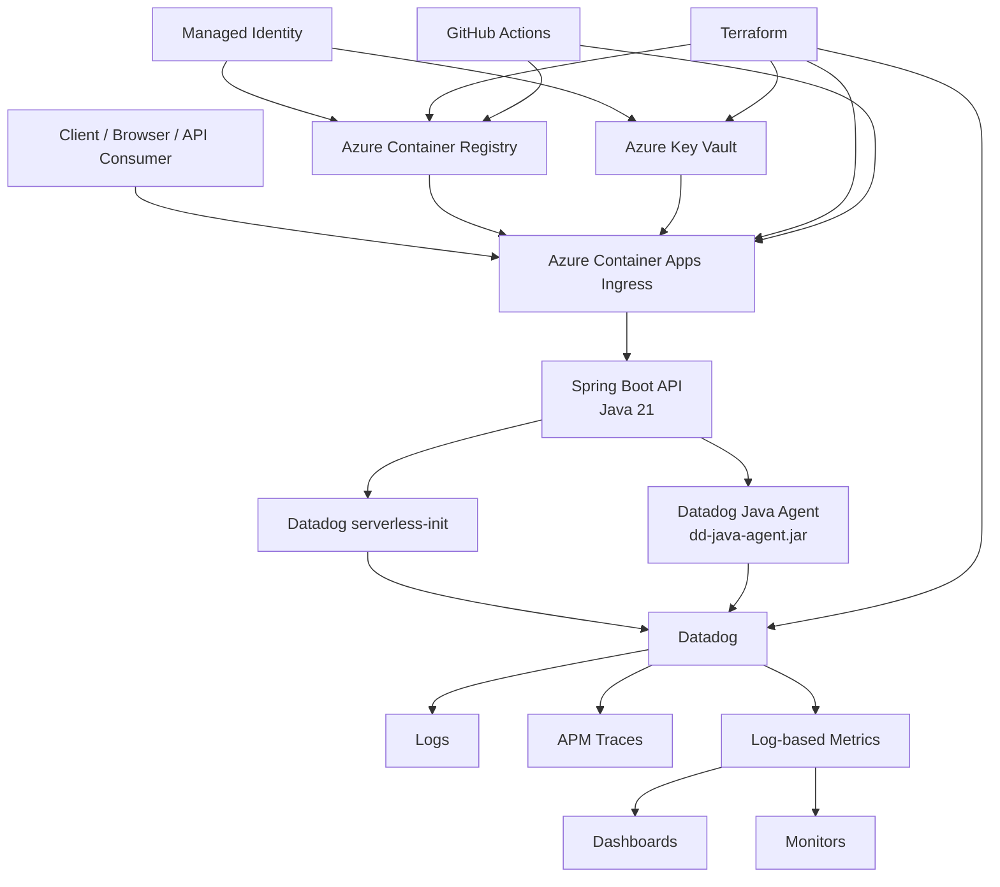
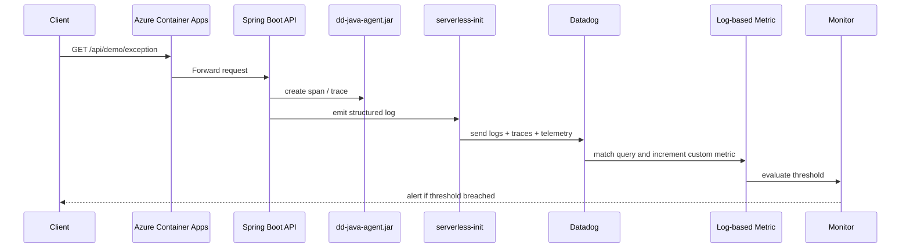

# 1. Architecture

## Objective
Create a secure, observable Java API platform where:
- application failures can be traced to exact requests
- Azure runtime health is visible
- business outcomes are measurable
- deployments can be correlated with errors and latency

## Main components

| Layer | Component | Purpose |
|---|---|---|
| Edge | Azure Front Door or secure ACA ingress | Public HTTPS entry |
| Runtime | Azure Container Apps | Runs Spring Boot revisions |
| Registry | Azure Container Registry | Stores immutable images |
| Secrets | Azure Key Vault | Stores sensitive config |
| Identity | Managed Identity | Passwordless Azure access |
| IaC | Terraform | Provisions Azure + Datadog resources |
| CI/CD | GitHub Actions | Build, test, push, deploy, validate |
| Observability | Datadog | Logs, APM, metrics, monitors, dashboards, events |

## Architecture diagram



GitHub-friendly rendered diagrams are also available here:
- `docs/diagrams/architecture.png`
- `docs/diagrams/telemetry-flow.png`
- `docs/diagrams/e2e-datadog-connectivity.png`

## End-to-end observability flow



## Azure Container Apps revision strategy
Use multiple revision mode:
- `blue` = stable
- `green` = candidate
- green starts at 0% production traffic
- green is tested through its label-specific FQDN
- promotion shifts traffic
- rollback shifts traffic back to stable

## Planned API surface
- `GET /api/health/live`
- `GET /api/health/ready`
- `POST /api/login`
- `POST /api/magic-link`
- `POST /api/qr-code`
- `GET /api/eligibility/{clinicId}`
- `POST /api/eligibility`
- `GET /api/demo/success`
- `GET /api/demo/failure`
- `GET /api/demo/slow`
- `GET /api/demo/exception`

## Key runtime connectivity

### Application runtime
```text
User
  -> ACA ingress
  -> Spring Boot app
  -> Datadog Java tracer
  -> Datadog serverless-init
  -> Datadog
```

### Secret flow
```text
Key Vault secret (datadog-api-key)
  -> Managed Identity authorization
  -> ACA secret reference
  -> DD_API_KEY env var
  -> Datadog intake
```

### Deployment flow
```text
GitHub Actions / local Docker build
  -> ACR
  -> ACA new revision
  -> health check
  -> smoke tests
  -> Datadog telemetry verification
```

## Related diagrams and runbooks
- [Build everything again from zero](BUILD-FROM-SCRATCH.md)
- [Deployment runbook](DEPLOYMENT-RUNBOOK.md)
- [Datadog setup](DATADOG-SETUP.md)
- [Diagrams index](diagrams/README.md)
- [Screenshots](screenshots)
