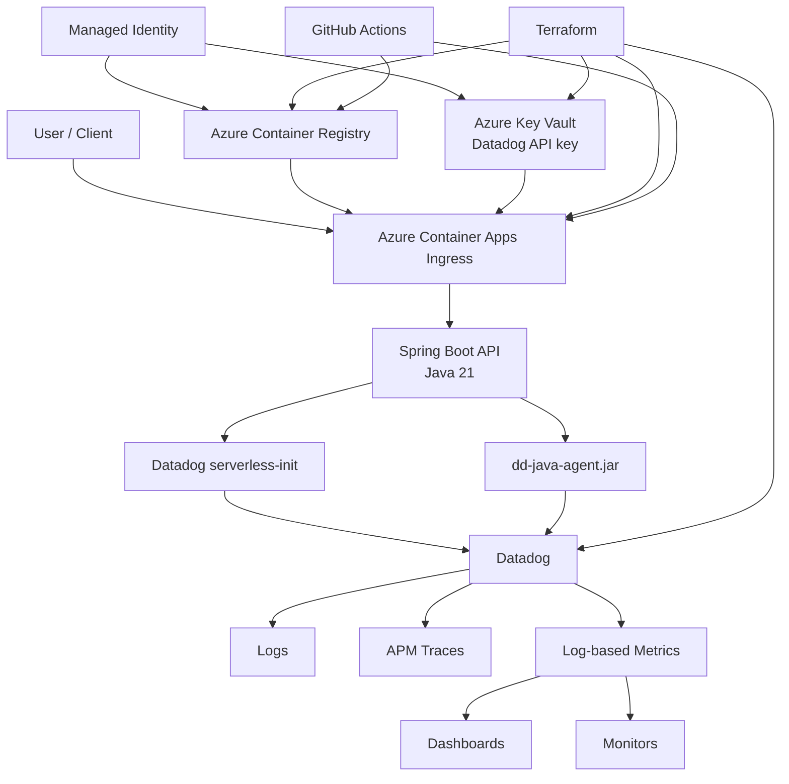
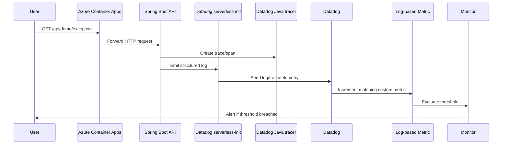

# Build Everything Again From Zero

This runbook is the **repeatable from-scratch guide** for rebuilding the project on a new machine or in a fresh Azure subscription.

Use it when you want to recreate:
- local Java development
- local Datadog tracing
- Terraform state bootstrap
- Azure infrastructure
- Key Vault secret wiring
- Docker build and push
- Azure Container Apps deployment
- Datadog resources
- end-to-end validation
- GitHub Actions validation

> This guide assumes the code in this repository is your source of truth.

---

## 1. Prerequisites

Install these tools locally:

- Git
- Java 21
- Maven 3.9+
- Docker Desktop
- Azure CLI
- Terraform
- PowerShell or Bash

Recommended checks:

```bash
java -version
mvn -version
docker --version
az version
terraform version
git --version
```

---

## 2. Clone the repository

```bash
git clone <your-repo-url>
cd datadog-java-azure-complete-working
```

---

## 3. End-to-end architecture

## High-level architecture



## End-to-end telemetry flow



Rendered diagrams are also available in [`docs/diagrams/`](diagrams/README.md).

---

## 4. Understand the application layout

Important folders:

```text
app/                         Spring Boot application + Dockerfile
terraform/bootstrap-state/   Remote-state bootstrap
terraform/environments/dev/  Azure infrastructure root
terraform/modules/           Reusable Azure modules
terraform/datadog/dev/       Datadog metrics, monitors, dashboard, SLO
.github/workflows/           CI / deploy / rollback workflows
docs/                        Architecture, runbooks, troubleshooting
scripts/                     Local smoke/validation helpers
```

---

## 5. Build and test the application locally

```bash
cd app
mvn clean test
mvn package
```

Run locally without Datadog first:

```bash
java -jar target/eligibility-api-0.0.1-SNAPSHOT.jar
```

Validate:

```bash
curl http://localhost:8080/api/health/live
curl http://localhost:8080/api/demo/success
curl http://localhost:8080/api/demo/exception
```

Expected behavior:
- `/api/health/live` returns success
- `/api/demo/success` returns 200
- `/api/demo/exception` returns 500 and generates structured error telemetry

---

## 6. Download and verify the Datadog Java agent

From `app/`:

```bash
curl -L 'https://dtdg.co/latest-java-tracer' -o dd-java-agent.jar
ls -l dd-java-agent.jar
```

The application image and local run both expect this file.

---

## 7. Verify local Datadog Agent connectivity

Before using the Java agent locally, make sure something is listening on `8126`:

```bash
lsof -nP -iTCP:8126 -sTCP:LISTEN
curl http://localhost:8126/info
```

If you already have the Datadog Agent installed locally, you should see the trace-agent info response.

Optional Java tracer connectivity test:

```bash
java -jar ./dd-java-agent.jar sampleTrace -c 1
```

---

## 8. Run the app locally with Datadog tracing

From `app/`:

```bash
export DD_SERVICE=eligibility-api
export DD_ENV=dev
export DD_VERSION=local
java -javaagent:dd-java-agent.jar -jar target/eligibility-api-0.0.1-SNAPSHOT.jar
```

Validate again:

```bash
curl http://localhost:8080/api/health/live
curl http://localhost:8080/api/demo/success
curl http://localhost:8080/api/demo/exception
```

What to check:
- local console logs show structured JSON
- Datadog tracer config appears in startup logs
- local Datadog APM receives traces

---

## 9. Bootstrap Terraform remote state (optional but recommended)

From repo root:

```bash
cd terraform/bootstrap-state
terraform init
terraform fmt -recursive
terraform validate
terraform plan
terraform apply
```

This creates a dedicated resource group + storage account + blob container for remote state.

After bootstrap, configure the backend in `terraform/environments/dev` if needed and migrate state.

---

## 10. Create Azure infrastructure

From repo root:

```bash
cd terraform/environments/dev
terraform init
terraform fmt -recursive
terraform validate
terraform plan
terraform apply
```

This provisions:
- resource group
- VNet + ACA subnet
- Log Analytics workspace
- Azure Container Registry
- user-assigned managed identity
- Key Vault
- Container Apps Environment
- Azure Container App

Capture outputs:

```bash
terraform output
```

Important outputs include:
- `acr_name`
- `acr_login_server`
- `container_app_name`
- `container_app_fqdn`
- `resource_group_name`
- `key_vault_name`
- `managed_identity_id`

---

## 11. Put the Datadog API key into Key Vault

The application runtime needs the Datadog **API key**. Do not hard-code it in Terraform source.

Set it in your shell first:

```bash
export DD_API_KEY='<your-datadog-api-key>'
```

Then create/update the Key Vault secret:

```bash
cd terraform/environments/dev
KV_NAME=$(terraform output -raw key_vault_name)
az keyvault secret set \
  --vault-name "$KV_NAME" \
  --name datadog-api-key \
  --value "$DD_API_KEY"
```

The Container App reads this secret by managed identity and exposes it as the secret-backed env var `DD_API_KEY`.

---

## 12. Review the Dockerfile and Datadog startup model

This project uses:
- `serverless-init` as the container entrypoint
- `dd-java-agent.jar` as the Java tracing agent
- `JAVA_TOOL_OPTIONS=-javaagent:/app/dd-java-agent.jar`

Conceptually:

```text
/app/datadog-init  -> entrypoint
java -jar /app/app.jar  -> container command
/app/dd-java-agent.jar  -> Java agent attached through JAVA_TOOL_OPTIONS
```

---

## 13. Build the Docker image locally

From repo root:

```bash
cd app
docker build -t eligibility-api:local .
```

Inspect the image:

```bash
docker image inspect eligibility-api:local --format 'Entrypoint={{json .Config.Entrypoint}} Cmd={{json .Config.Cmd}}'
```

Expected:

```text
Entrypoint=["/app/datadog-init"] Cmd=["java","-jar","/app/app.jar"]
```

Inspect files inside the image:

```bash
docker run --rm --entrypoint /bin/sh eligibility-api:local -c "ls -l /app"
```

You should see:
- `app.jar`
- `datadog-init`
- `dd-java-agent.jar`

---

## 14. Test the container locally

Run the final container image locally with Datadog settings:

```bash
docker run --rm -p 8080:8080 \
  -e DD_API_KEY="$DD_API_KEY" \
  -e DD_SITE=datadoghq.com \
  -e DD_SERVICE=eligibility-api \
  -e DD_ENV=dev \
  -e DD_VERSION=local-container \
  -e DD_LOGS_ENABLED=true \
  -e DD_LOGS_INJECTION=true \
  -e DD_SOURCE=java \
  -e JAVA_TOOL_OPTIONS="-javaagent:/app/dd-java-agent.jar" \
  eligibility-api:local
```

Validate:

```bash
curl http://localhost:8080/api/health/live
curl http://localhost:8080/api/demo/exception
```

---

## 15. Build the Azure-compatible image and push to ACR

Azure Container Apps expects a Linux AMD64 image. This matters especially on Apple Silicon machines.

From repo root:

```bash
cd terraform/environments/dev
ACR_NAME=$(terraform output -raw acr_name)
ACR_SERVER=$(terraform output -raw acr_login_server)
RG=$(terraform output -raw resource_group_name)
APP=$(terraform output -raw container_app_name)

az acr login --name "$ACR_NAME"

cd ../../../app
docker buildx build \
  --platform linux/amd64 \
  -t "$ACR_SERVER/eligibility-api:v3" \
  --push \
  .
```

Verify tags in ACR:

```bash
az acr repository show-tags \
  --name "$ACR_NAME" \
  --repository eligibility-api \
  --output table
```

---

## 16. Deploy the image to Azure Container Apps

From repo root:

```bash
cd terraform/environments/dev
ACR_SERVER=$(terraform output -raw acr_login_server)
RG=$(terraform output -raw resource_group_name)
APP=$(terraform output -raw container_app_name)

az containerapp update \
  --name "$APP" \
  --resource-group "$RG" \
  --image "$ACR_SERVER/eligibility-api:v3"
```

Check revisions:

```bash
az containerapp revision list \
  --name "$APP" \
  --resource-group "$RG" \
  --output table
```

Wait until the newest revision is `Healthy`.

---

## 17. Validate ACA runtime configuration

Check the active Datadog env vars:

```bash
az containerapp revision show \
  --name "$APP" \
  --resource-group "$RG" \
  --revision <latest-revision-name> \
  --query "properties.template.containers[0].env" \
  --output table
```

You should see at least:
- `DD_API_KEY` with `SecretRef=datadog-api-key`
- `DD_SITE=datadoghq.com`
- `DD_SERVICE=eligibility-api`
- `DD_ENV=dev`
- `DD_VERSION=v3`
- `DD_LOGS_ENABLED=true`
- `DD_LOGS_INJECTION=true`
- `DD_SOURCE=java`
- `DD_AZURE_SUBSCRIPTION_ID=...`
- `DD_AZURE_RESOURCE_GROUP=rg-observe-dev`
- `JAVA_TOOL_OPTIONS=-javaagent:/app/dd-java-agent.jar`

---

## 18. Validate the deployed application

Get the FQDN:

```bash
FQDN=$(az containerapp show \
  --name "$APP" \
  --resource-group "$RG" \
  --query properties.configuration.ingress.fqdn \
  --output tsv)
```

Run smoke tests:

```bash
curl "https://$FQDN/api/health/live"
curl "https://$FQDN/api/demo/success"
curl "https://$FQDN/api/demo/failure"
curl "https://$FQDN/api/demo/slow"
curl "https://$FQDN/api/demo/exception"
```

Generate business traffic:

```bash
curl -X POST \
  -H 'Content-Type: application/json' \
  -d '{"clinicId":"CLINIC-123"}' \
  "https://$FQDN/api/magic-link"
```

---

## 19. Check Azure-side logs when troubleshooting

System logs:

```bash
az containerapp logs show \
  --name "$APP" \
  --resource-group "$RG" \
  --type system \
  --tail 100
```

Console logs for a revision:

```bash
az containerapp logs show \
  --name "$APP" \
  --resource-group "$RG" \
  --revision <latest-revision-name> \
  --type console \
  --tail 100
```

---

## 20. Create Datadog resources

Set Datadog provider credentials in the shell:

```bash
export DD_API_KEY='<your-datadog-api-key>'
export DD_APP_KEY='<your-datadog-app-key>'
```

Apply Datadog Terraform:

```bash
cd terraform/datadog/dev
terraform init -upgrade
terraform fmt -recursive
terraform validate
terraform plan
terraform apply
```

This creates:
- log-based metrics
- monitors
- dashboard
- SLO

---

## 21. Verify Datadog logs, traces, and metrics

### Logs

In Datadog Log Explorer, start with:

```text
service:eligibility-api
```

Useful structured searches:

```text
service:eligibility-api @event_name:user.endpoint_accessed
service:eligibility-api @event_name:user.endpoint_access_failed
service:eligibility-api @event_name:magic_link.requested
service:eligibility-api @event_status:error
service:eligibility-api @http_status_code:500
```

### APM

In Datadog APM, look for service:

```text
eligibility-api
```

### Trace/log correlation

Open a failing trace and confirm logs contain a trace ID and the structured fields such as:
- `event_name`
- `event_status`
- `endpoint`
- `correlation_id`
- `request_id`
- `http_status_code`

### Metrics

Check the custom metrics created from logs, for example:
- `app.user.endpoint.success`
- `app.user.endpoint.failure`
- `app.user.endpoint.duration`
- `app.magic_link.requests`
- `app.login.failure`

---

## 22. Trigger monitors intentionally

Generate fresh failing traffic:

```bash
for i in $(seq 1 10); do
  curl "https://$FQDN/api/demo/exception"
done
```

Then verify in Datadog:
- logs appear with `@event_name:user.endpoint_access_failed`
- custom failure metric increments
- monitor changes from `OK` to `Alert` if threshold is reached

---

## 23. Test GitHub Actions

Expected workflows:
- `CI`
- `Deploy to ACA`
- `Roll back ACA traffic`

### Configure GitHub

Add repository secrets:
- `AZURE_CLIENT_ID`
- `AZURE_TENANT_ID`
- `AZURE_SUBSCRIPTION_ID`

Add repository variables:
- `AZURE_RESOURCE_GROUP`
- `AZURE_CONTAINER_APP_NAME`
- `AZURE_ACR_NAME`

### Test sequence

1. Push to a feature branch.
2. Open a PR and confirm `CI` passes.
3. Merge or switch to the target branch.
4. Run `Deploy to ACA` manually from GitHub Actions.
5. Verify a new ACA revision becomes healthy.
6. Validate `/api/health/live` and `/api/demo/success`.
7. Confirm logs and APM continue to flow to Datadog.

---

## 24. Most important debugging checkpoints

If something breaks again, these commands usually find the issue fastest:

```bash
# local ports
lsof -nP -iTCP:8080 -sTCP:LISTEN
lsof -nP -iTCP:8126 -sTCP:LISTEN
curl http://localhost:8126/info

# image inspection
docker image inspect eligibility-api:local --format 'Entrypoint={{json .Config.Entrypoint}} Cmd={{json .Config.Cmd}}'
docker run --rm --entrypoint /bin/sh eligibility-api:local -c "ls -l /app"

# ACR
az acr repository show-tags --name <acr-name> --repository eligibility-api --output table

# ACA
az containerapp revision list --name <app> --resource-group <rg> --output table
az containerapp logs show --name <app> --resource-group <rg> --type system --tail 100
az containerapp logs show --name <app> --resource-group <rg> --revision <rev> --type console --tail 100

# Datadog Terraform
terraform init -upgrade
terraform plan

# Datadog query patterns
service:eligibility-api @event_name:user.endpoint_access_failed
service:eligibility-api @event_name:user.endpoint_accessed
service:eligibility-api @event_status:error
```

---

## 25. Related documents

- [Architecture](ARCHITECTURE.md)
- [Datadog setup](DATADOG-SETUP.md)
- [Terraform guide](TERRAFORM-GUIDE.md)
- [Deployment runbook](DEPLOYMENT-RUNBOOK.md)
- [GitHub Actions](GITHUB-ACTIONS.md)
- [Troubleshooting](TROUBLESHOOTING.md)
- [Work completed](WORK-COMPLETED.md)

